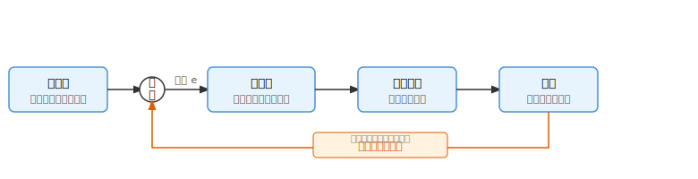

# 自分のキャリアについて一緒に考えてみよう。

Kusano Tomoki

---
# 自己紹介

### 個人的なこと

- 茨城県在住
  - 東京までドアツードア 3時間
- 子供 2 人（長女は今年生まれましたー）

---

### 経歴
高専→大学工学部→大学院（中退）→ 社会人5 年目

### 技術スタック

- フルスタックな開発領域
  - フロントエンド、モバイル領域に強み
- アジャイルな開発スタイルに親和性
  - チームの円滑な運営に対するサポート
  - プロダクト品質を担保するテスト戦略

---
### 現在興味があること

- エンジニアリング組織の成長について
  - 「学習し続ける組織」の構築
  - 心理的安全性の確保
- サーバント・リーダーシップ論
  - メンバーを主役とし、奉仕者・支援者としてメンバーの成長を後押しする
    （...いつか勉強会で話したい）

---

# こんな私ですが、
# ずっとキャリアについて悩んでいます

---

## キャリアについて悩む要因としては

- AI による技術革新のスピード
- 働き方の多様化とライフステージによる制限
- SNS などによる多様なキャリア（怪しい）の情報量の多量化
- IT 業界の対応範囲の広域化

## などなど

---

# そもそもキャリアとは？

---

## 広域的な定義

人生全体を通じた**仕事・学習・余暇・家庭**などすべての役割の総体。
職業に限らず、個人が生涯にわたって築くアイデンティティや成長の軌跡を指す。

> _"Career is the sequence of roles a person plays across a lifetime."_
> — Donald E. Super (1980), *A Life-Span, Life-Space Approach to Career Development*

- 参考: Super, D. E. (1980). A life-span, life-space approach to career development.  
  *Journal of Vocational Behavior, 16*(3), 282–298.  
  https://doi.org/10.1016/0001-8791(80)90056-1

---

## 狭域的な定義

特定の**職種・職業における経験・職歴・昇進の連鎖**。
何の仕事をしてきたか、どのような専門性を積み上げてきたかという職業的な軌跡を指す。

> 「個人が生涯にわたって担う一連の職務の経験の連鎖」
> — 厚生労働省「キャリア形成を支援する労働市場政策研究会」報告書（2002年）

- 参考: 厚生労働省（2002）「キャリア形成を支援する労働市場政策研究会」報告書  
  https://www.mhlw.go.jp/houdou/2002/07/h0731-3a.html

---

## つまり、「仕事」と「人生」は切り離せない

| | 広義的なキャリア | 狭義的なキャリア |
|---|---|---|
| 視点 | 人生全体 | 職業・職歴 |
| 対象 | 役割・成長・アイデンティティ | 経験・専門性・昇進 |

<br>

どちらの定義においても、**仕事における選択・経験が人生そのものに影響を与え続ける**。

<br>

### ゆえに、**キャリアの最大化こそが人生における最大の目標となる**

> 職業的な成長と人生の充実を同時に追求すること——それがキャリアを考える上での究極の命題である。

---

## では、なぜ今日キャリアの話をするのか

**① 評価する立場・される立場、両面を経験したから**

- 課長として、メンバーの評価を行う立場になった
- 同時に、自分自身も評価される立場である
- 両面を経験して初めて、**キャリアの方向性が評価と深く結びついている**ことを実感した

<br>

**② 組織の中で、各社員の価値を最大化したいから**

- 現在の組織において、メンバー一人ひとりがもつ可能性を最大限に引き出したい
- そのためには、**本人がキャリアを意識し、自律的に描けること**が不可欠である
- キャリアへの意識なき成長支援は、方向性を持たない投資になりかねない

---

## 今日、一緒に考えたい 3 つのこと

# 1. 自身のキャリアに対してオーナーシップを持つ

# 2. 等身大の自分を把握する

# 3. キャリアの構築は個人だけでは限界がある

---

# 1. 自身のキャリアに対してオーナーシップを持つ


---

## IT エンジニアとして取りうるキャリアパス例

オーナーシップを持つ第一歩は、**自分が選べるキャリアの選択肢を知ること**から始まる。
<small>

| キャリアパス | 概要 |
|---|---|
| **スペシャリスト** | 特定技術・領域を極める専門家（例: セキュリティ、ML、インフラ）|
| **テックリード** | 技術的意思決定をリードするチームの技術責任者 |
| **エンジニアリングマネージャー** | 人・組織・採用を管轄するピープルマネジメント職 |
| **プロダクトマネージャー** | エンジニア経験を活かしてプロダクト戦略を担う |
| **スクラムマスター / アジャイルコーチ** | チームのプロセス改善・組織変革を推進 |

<br>

> どのパスも「正解」はない。自分の価値観・強み・ライフスタイルと照らし合わせることが重要。
</small>
---

## では、これらのキャリアパスに就くには何をすればいい？

<br>

### 資格？　経験年数？　特定のスキル？

<br>

## 実は、明確なボーダーラインは存在しない

> どのキャリアパスも、「この条件を満たせば就ける」という定義はない。
> なぜなら、**キャリアは他者が認めた瞬間にはじめて成立する**からである。

---

## 個人のオーナーシップを活かすために、組織として定義すべきことがある

個人がキャリアのオーナーシップを発揮するには、**判断の拠り所となる基準が組織側に必要**である。
ボーダーラインが存在しないからといって、何も定義しないことは個人の成長機会を奪う。

<br>

組織は各ポジションに対して、以下を明文化する責任がある：

- **職責（Role & Responsibility）** — そのポジションが担うべき役割と責任の範囲
- **期待水準（Expectation Level）** — そのポジションで「できているべき」スキル・行動・成果
- **評価軸（Evaluation Criteria）** — どのような観点で貢献が評価されるか

---

## 現在の組織でのオーナーシップ発揮に向けた状況

現在所属する組織は、**成長途中**というフェーズにある。

- 職責や期待水準の明文化は、まだ**整備途中**である

<br>

### 今後、整備を進める上で避けるべきでないこと

**自主性を持って健全な摩擦・議論をいとわない姿勢**が必要である。

- 個人の評価・役割に直結するため、感情的な反発が生じる場面もある
- それでも**対話を重ねて合意を形成するプロセス**こそが、組織の成熟につながる

---

## オーナーシップとは ── 自主性を持ち、健全な摩擦をいとわない姿勢

<small>

### 🔹 自主性 ── 自身のキャリアに対する意識を持つ

- キャリアの主体は**自分自身**である
- 会社・上司に委ねるのではなく、自ら考え、自ら選択する
- 「与えられる成長」ではなく、「自ら取りにいく成長」を意識する


### 🔹 健全な摩擦・議論 ── 正確な現状把握と理論に基づいた対話

- まず**現状を正確に把握する** ── 感情ではなく、事実・データ・経験から語る
- 理論立てて話す ── 「なぜそう思うか」の根拠を持って議論に臨む
- 摩擦を恐れない ── **意見の衝突は、より良い判断への過程**である


> この2つの姿勢を持ち続けることが、**組織内における自身のキャリアの最大化につながる**と感じている。

> </small>

---

## マネージャーの役割

<br>

### 評価者としての役割

- **公正な評価** ── 職責・期待水準に照らした客観的な評価を行う
- **フィードバックの質** ── 評価結果を「判定」で終わらせず、次のアクションに結びつける
- **成長の可視化** ── メンバーの現在地と目指す姿をともに言語化する

<br>

---

## マネージャーの役割

### キャリア支援者としての役割

- メンバーが**自律的にキャリアを描けるよう**、機会・情報・対話を提供する
- 個人の強みを組織の文脈に接続し、**活躍の場をデザインする**
- キャリアの方向性に対して、**承認・後押しをする存在**であること

---

## 被評価者の役割

マネージャーが支援者であるならば、**被評価者もまた能動的な役割を担う**。


### 自分を正しく伝える

- 自身のできること・できないことを**正直かつ明確に言語化する**
- キャリアの希望や考えを、評価の場だけでなく**日常的に発信する**
- 「察してもらう」ではなく、**自ら開示することで信頼の土台をつくる**


### 信頼を勝ち取るための実績を積む

- 言葉だけでなく、**行動・成果で示す**ことが関係性の基盤となる
- 小さな約束を守り続けることが、**長期的な信頼につながる**
- 評価者に「この人に任せたい」と思わせる実績の積み重ねが、キャリアの扉を開く

---

## 結局、キャリアは「待つ」ものではない

> **誰もあなたのキャリアを代わりに作ってはくれない。**

<br>

- 上司が気づいてくれるのを待つ ✗
- 会社が機会を与えてくれるのを待つ ✗
- 評価が上がるのを待つ ✗

<br>

**自分から動いた人間にだけ、キャリアは拓ける。**

- 希望を言語化して伝える
- 挑戦できる場を自ら取りにいく
- 現状に対して問いを立て、声を上げる

---

# 2. 等身大の自分を把握する

---

## なぜ、等身大の自分を把握しなくてはいけないのか

能動的に動くためには、**まず自分がどこに立っているかを知る必要がある**。

<br>

- 自分の強みを知らなければ、**何を売りにして動けばいいか分からない**
- 自分の弱みを知らなければ、**どこを補えばいいか分からない**
- 自分の価値観を知らなければ、**どのキャリアが自分にとって正解か判断できない**

<br>

> 地図を持たずに目的地へは向かえない。
> **等身大の自分を把握することが、キャリア設計の出発点である。**

---

## 等身大の自分をどのように把握するか

### 1. 周りの人からのフィードバックを受け取る

- 上司・同僚・後輩など、**多様な視点からの評価を集める**
- 自分では気づけない強み・癖・盲点が浮かび上がる
- **マイナスなフィードバックこそ、成長の手がかりである**
    - マイナスなフィードバックに対して、どのように動くかを整理することで出力が変わる


---

## 等身大の自分をどのように把握するか

### 2. 自己分析を行う

- これまでの経験・仕事・取り組みを**時系列で書き出す**
- 「何が得意だったか」「何にやりがいを感じたか」を整理する
- 経験年数によって、意思決定のプロセスについても求められる

#### AI との対話による自己分析

- 自分の経験や悩みを AI に話しかけることで、**言語化の補助**として活用できる
- 「自分の強みは何か」「なぜこの仕事が好きか」を問いかけ形式で深掘りしてもらう
- 一人では気づきにくい**思考のパターンや矛盾**を引き出せる場合がある
- ただし AI の回答はあくまで**仮説の材料**であり、最終的な判断は自分で行う

---

## 把握した結果を言語化する

フィードバックと自己分析を通じて得た気づきを、**自分の言葉でまとめる**。

<br>

| 問い | 記述例 |
|---|---|
| 自分の強みは何か | 「複雑な問題を構造化して整理する力がある」 |
| 自分の弱みは何か | 「細部のこだわりが強く、スピードが落ちる場面がある」 |
| 何にやりがいを感じるか | 「チームの課題を解決したとき、人の成長に関わったとき」 |
| どんな環境で力を発揮するか | 「裁量があり、変化の多い環境」 |

<br>

> この「等身大の自分像」が、目標設定の土台になる。

---

# 把握したら、次は目標を設定する

---

## 等身大の自分を把握したら ── 目標を設定する

自分の強み・弱み・価値観が整理できたら、次は**向かう先を定める**。

<br>

### 目標設定の考え方

- **長期目標**（3〜5年）── 自分はどこに向かいたいか。どんな存在でありたいか。
- **中期目標**（1〜2年）── 長期目標に近づくために、この期間で何を達成するか。
- **短期目標**（3〜6ヶ月）── 今すぐ取り組める、具体的なアクション。

<br>

> 目標は「理想」から逆算して設定する。
> 大きすぎる目標は、**細分化してはじめて行動に落とし込める**。

---

## 目標の細分化

大きな目標をそのまま持ち続けても、行動には繋がりにくい。

```
長期目標（3〜5年）
  └── 中期目標（1〜2年）
        └── 短期目標（3〜6ヶ月）
              └── 今週・今月のアクション
```

<br>

- **Why**（なぜその目標か）を常に言語化しておく
- **進捗を定期的に振り返る** ── 目標は固定ではなく、状況に応じて更新してよい
- 達成可能な小さな成功体験が、**次の行動への推進力**になる

---
<small>

## 目標レイヤーと社内外での評価の対応

各レイヤーの目標が、組織の中でどのように評価・期待されるかを把握することで、**目標の解像度が上がる**。


| 目標レイヤー | 問い | 組織・業界での評価軸 |
|---|---|---|
| **長期（3〜5年）** | どんな人材でありたいか | ポジション・影響範囲。上位職ほど「組織への貢献」が求められる |
| **中期（1〜2年）** | 何を積み上げるか | 職種・領域の専門性。そのポジションの期待水準と照合できるレベル |
| **短期（3〜6ヶ月）** | 今何に取り組むか | 実績・アウトプット。評価面談で語れる具体的な成果 |
| **日次・週次** | 今日何をするか | 直接評価されないが、積み重ねが中期目標の土台になる |

</small>

---

## 目標レイヤーと社内外での評価の対応

業界全体での期待水準を知ることは、自分の現在地を客観視するための参考になる。
 ただし目的は**組織の中で自分の価値を最大化すること**であり、それが結果的に自身のキャリアの充実につながる。

---

## 等身大の自分を把握して、次の目標を決めよう。

> **「等身大の自分」を起点に、目標を設定し、行動する。**

<br>

- 能動的に動くには、まず**自分の現在地を知ることが出発点**
- 他者からのフィードバックと自己分析で、自分を多角的に把握する
- 把握した結果を**自分の言葉で言語化する**

<br>

**サイクルを繰り返すことが、キャリアの継続的な成長につながる。**

- 長期→中期→短期→日次に細分化し、逆算で行動に落とし込む
- 組織・業界の期待水準と照らし合わせ、目標の解像度を高める
- 目標は固定せず、定期的に振り返り更新する

---

# 3. キャリアの構築は個人だけでは限界がある

---

## キャリアの最大化は「需要と供給」に密接に関係している

> **いくら自分を磨いても、求められなければキャリアは最大化されない。**

<br>

- **供給（自分側）** ── スキル・経験・強み・価値観
- **需要（組織・市場側）** ── 求めているポジション・能力・成果

<br>

**キャリアの最大化とは、この需要と供給が一致したときに起きる。**

- 自分の強みが組織に求められていなければ、価値は発揮しにくい
- 組織のニーズを知らなければ、努力の方向性がずれていく
- **需要を理解した上で、自分の供給を磨くことが重要である**

---

<small>

## 需要と供給のミスマッチで起きること

> **努力の方向が需要とずれると、成果は出ているのに評価されない状態に陥る。**

- **ライバルが多い領域に集中しすぎる**
  - 同じスキルを持つ人が多く、差別化が難しくなる
  - 希少性がなければ、交渉力・評価力は上がりにくい

- **組織が求めていないスキルを磨き続ける**
  - 個人の成長はあるが、組織への貢献として認識されにくい

- **需要の変化に気づかず取り残される**
  - 技術トレンド・組織のフェーズによって求められる役割は変わる
  - 過去に通用したスキルが陳腐化するリスクがある

**ミスマッチを防ぐには、組織・市場の需要を継続的に読むことが必要である。**

</small>

---

<small>

## ミスマッチが組織にもたらすリスク

需要と供給のミスマッチは、個人だけでなく**組織全体にも悪影響を与える**。

- **戦力の空洞化**
  - 必要なポジションに適切な人材がおらず、事業推進が滞る
  - 外部採用でカバーしようとするとコストと時間がかかる

- **エンゲージメントの低下**
  - 「自分が活かされていない」と感じるメンバーのモチベーションが下がる
  - 優秀な人材ほど、需要のある場所へ離れていきやすい

- **組織学習の停滞**
  - キャリアの方向性が個人任せになると、組織が必要とするスキルが蓄積されない
  - 将来の組織ニーズに対応できる人材が育たない

</small>

---

## ミスマッチを解消するには、個人と組織が一緒に動く必要がある

> **キャリアの構築は、個人の努力だけでも、組織の管理だけでも完結しない。**

<br>

| | 個人がすべきこと | 組織がすべきこと |
|---|---|---|
| **需要を知る** | 組織・業界が求めるスキルを把握する | 求めるポジション・期待水準を明文化する |
| **供給を磨く** | 目標を設定し、自律的に成長する | 成長の機会・場・フィードバックを提供する |
| **ズレを修正する** | 定期的に目標と現実を振り返る | 1on1・評価面談で対話し、方向を調整する |

---

## もう一つのミスマッチ ── 顧客との意識のずれ

**個人と組織の関係だけでなく、外部（顧客）との関係も個人では完結しない。**

<small>

> **顧客はお金を出す側である。最初は「できること」にのみ興味を持つ。**

<br>

- 関係の入口では、「やりたいこと」より **「できること」が評価の対象**になる
  - スキル・実績・解決できる課題が、顧客との信頼の第一歩になる
- ただし **「やりたいこと」を実現することもキャリアの最大化に不可欠**である
  - やりたいことが実現できると、モチベーションと成果の好循環が生まれる

<br>

**やりたいことを実現するには、まず顧客・組織からの信頼を積み上げる必要がある。**

- 「できること」で着実に成果を出し、信頼残高を高める
- 信頼が積み上がることで、「やりたいこと」を提案・実現できる余地が生まれる
- **信頼は、やりたいことへの入場券である**

</small>

---

## だからこそ、周囲との関係が重要になる

> **需要と供給のミスマッチを解消し、キャリアを最大化するには──個人の努力だけでなく、組織の仲間との関係が欠かせない。**

---

<small>

## 同じ組織の仲間は、あなたのキャリアの協力者である

> **キャリアは一人で築くものではない。同じ組織にいる人間が、最大の協力者になりうる。**

<br>

- **フィードバックをくれる人** ── 等身大の自分を把握する鏡になってくれる
- **機会をくれる人** ── 挑戦できる場・任せてもらえる仕事をつくってくれる
- **一緒に成長する人** ── お互いの強みを活かし、補い合いながら成長できる
- **方向性を示してくれる人** ── 先を歩く人の姿が、自分のキャリアの指針になる

<br>

**組織の中に信頼できる関係を築くことが、キャリアの可能性を広げる。**

- 孤立したキャリアは、成長の速度も範囲も限界がある
- 周囲を「競争相手」ではなく「協力者」として捉えることが、キャリア最大化への近道である

</small>

---

## 協力者へのリスペクトを忘れずに

> **あなたのキャリアを支えてくれる人は、時間と労力を使ってくれている。**

<br>

- フィードバックをくれる人は、あなたのために**正直に向き合ってくれている**
- 機会をくれる人は、あなたを**信頼してリスクを取ってくれている**
- 一緒に成長する仲間は、あなたの存在を**支えながら前に進んでいる**

<br>

**リスペクトは、信頼関係をつくる土台である。**

> 協力者へのリスペクトが、
> **次の協力者を生み、キャリアの連鎖をつくる。**

---

## リスペクトがなければ、優先度は下がる

> **仕事である以上、人は誰に時間・労力を使うかを選んでいる。**

<br>

- 協力者も自分のキャリア・業務を抱えている
  - フィードバックも、機会の提供も、**タダではない**
  - 大切にしてくれる相手を優先するのは、自然な人間の行動である
- **リスペクトのない関係は、協力の優先度を下げる**
  - 感謝のない相手への支援は、続けにくくなる
  - 無礼・無関心は、信頼残高を消耗させる
- **優先してもらえる人になることも、キャリア戦略のひとつである**
  - 周囲から「この人を助けたい」と思われる存在が、機会を引き寄せる

---

<small>

## キャリアの構築は、個人だけでは限界がある。

> **自分を磨くだけでは、キャリアは最大化されない。需要・組織・仲間との関係が、キャリアを動かす。**


- 需要と供給が一致して初めて、キャリアは最大化される
- ミスマッチは個人だけでなく、**組織全体にもリスクをもたらす**
- 個人と組織が対話し、**一緒に動くことでズレを解消できる**
- 顧客・仲間との信頼を積み上げることが、**やりたいことへの入場券**になる

<br>

**信頼とリスペクトが、キャリアの可能性を広げる。**

- 周囲を「競争相手」ではなく「協力者」として捉える
- 協力者へのリスペクトが、次の協力者を生む連鎖をつくる
- **優先してもらえる人になることも、キャリア戦略のひとつである**

</small>

---

<small>


# **キャリアの最大化とは、職業的な成長と人生の充実を同時に追求し続けることである。**

### 1. 自身のキャリアに対してオーナーシップを持つ
- キャリアの主体は**自分自身**。待つのではなく、自ら動く
### 2. 等身大の自分を把握する
- フィードバックと自己分析で、**自分の現在地を多角的に知る**
- 把握した自分像を起点に、長期→短期の目標を逆算して設定する
### 3. キャリアの構築は個人だけでは限界がある
- 需要と供給を合わせ、**組織・顧客・仲間との信頼を積み上げる**
- リスペクトが協力者を生み、**キャリアの連鎖をつくる**


**あなたのキャリアを動かすのは、あなた自身の行動である。**

</small>
