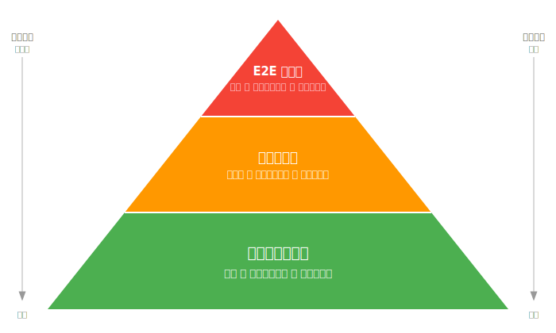
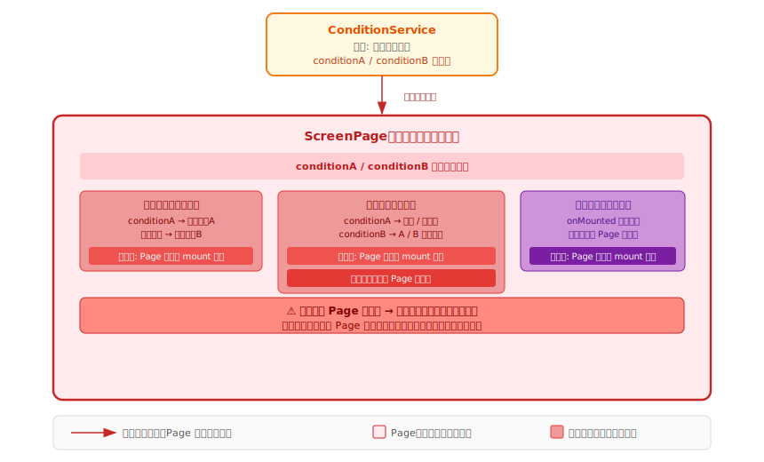
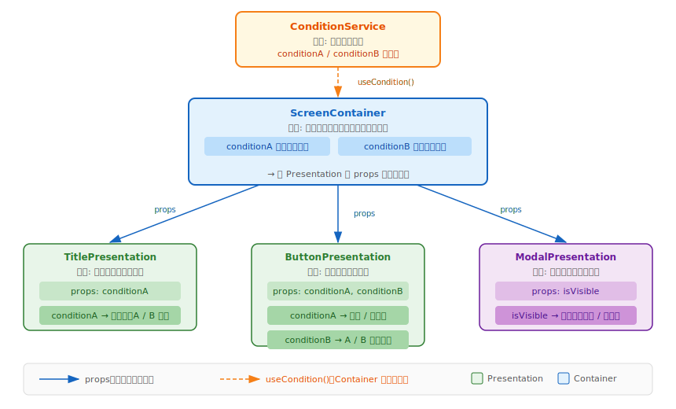
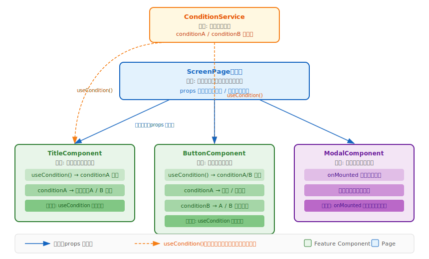

# 持続可能かつ品質担保のためのテストを組み込むUI 設計を考えよう

## Kusano Tomoki
### 2026/04/06

---

# 自動テストを利用していますか？

---

# 自動テストの目的・メリット

- 手動テストのコスト・工数削減
- 高頻度かつ迅速な実行によるソフトウェアの品質を担保
  - 人為的な操作性のムラを省くことによる、一貫した基準でのテスト実施
  - リグレッションテスト： 修正によって既存機能に影響がないか
- 開発プロセスの改善
  - CI で実現することで、***継続的な品質担保*** を実現

---

# 自動テストの種類

| 種類 | 概要 | 対象範囲 |
|------|------|----------|
| **ユニットテスト** | 関数・クラス単位の動作検証 | 小 |
| **インテグレーションテスト** | モジュール間の連携を検証 | 中 |
| **E2Eテスト** | ユーザー操作を模倣した全体フローの検証 | 大 |
| **スナップショットテスト** | UIの意図しない変更を検知 | 中 |

---

# 自動テストの種類ごとの相関図（テストピラミッド）

---

# テストの保守性

## 保守コストはプロダクトの複雑さに比例して増加する

テストの保守性を高めるためには、***複雑なことを簡潔に実現する必要*** がある

## テスト数が多ければ多いほど良いが、意味のあるテストである必要がある

テストを組み込んだ人しか意図を理解できず、不要なテストケースが増加してしまう

---
# 複雑なことを簡潔に実現を行おう

## このような要件の場合、どのようにUI を具備しますか？

- **タイトル**: 条件A が有効 → `タイトルA` を表示、それ以外 → `タイトルB` を表示
- **ボタン**:
  - 条件A が有効 → 活性
  - 押下時: 条件B が有効 → A 画面に遷移、無効 → B 画面に遷移
- **モーダル**: 対象画面の表示時に モーダル を表示

---

### パターンなし（Page に全ロジック）

---

### 各コンポーネンツごとの責務を分離し、疎結合なUI を構築

- 画面A では、ボタンを押すとB になる

- 画面A では、押すとB となるボタンを持つ

---

# Container / Presentation Pattern

| | Container コンポーネント | Presentation コンポーネント |
|---|---|---|
| **責務** | データ取得・状態管理・ロジック | UIの描画のみ |
| **依存** | Service / Store / API | props のみ |
| **テスト** | ロジックのユニットテスト | props に対するレンダリングテスト |
| **再利用** | 低い | 高い |

> ロジックを Container に集約し、Presentation は **pure な描画** に徹することで、
> テストの対象を明確に分離できる。

---

### Container / Presentation Pattern での実装

---

# Feature Component Pattern

<small>各コンポーネントが **composable（custom hook）** でデータ取得・ロジックを自己完結し、親（Container）は **コンポーネントを並べるだけ** に徹する構成。</small>

<small>

| 項目 | 内容 |
|---|---|
| **ロジックの場所** | composable（custom hook）に集約し、コンポーネントが内部で取得 |
| **composable のテスト** | コンポーネントから切り離してユニットテスト可能 |
| **コンポーネントのテスト** | composable をモックしてレンダリングテストが容易 |

</small>
<small>

> **テスト観点では composable 単体のユニットテストと、コンポーネントのレンダリングテストを分けて書く** ことが重要。

</small>

---

### Feature Component Pattern での実装

---
# プロジェクトに応じたコンポーネント設計手法を！

## ファイル数の増加に伴って、管理が煩雑になる傾向。
- チーム内でどのようにファイル・コンポーネント管理を行うかを整理

## プロジェクト規模に応じて、どのような設計を取り入れるべきかは判断。
- オーバーエンジニアリングのリスク
- スケールに合わせて戦略を立てて導入を行う。

---
# テスト数が多ければ多いほど良いが、意味のあるテストである必要がある

## 過剰なテストケース

## 目検で行うべきテストケース

---
# 過剰なテストケース

<small>**自明な内容や、フレームワークが保証していることをテストしても保守コストが増えるだけ。**

| ❌ 過剰なテスト例 | 理由 |
|---|---|
| コンポーネントが表示されているか | レンダリングはフレームワークの責務 |
| props で渡した文字列がそのまま表示されるか | 変換ロジックがなければ自明 |
| ボタン要素が存在するか | HTMLの構造確認はスナップショットで十分 |
| `v-if="true"` の要素が見えるか | 条件が定数なら意味をなさない |

> テストすべきは **「条件による振る舞いの変化」** であり、**「存在すること」ではない**。
</small>
---
# 目検で行うべきテストケース

デザイン通りか・正しい class が付与されているかなど、**視覚的な確認が必要なケースは自動テストに向かない。**

<small>

| 👁 目検テスト例 | 理由 |
|---|---|
| デザイン通りのレイアウトか | ピクセル・余白の確認は人の目が必要 |
| 正しい CSS class が付与されているか | class 名の存在は確認できても見た目は保証できない |
| ホバー・アニメーションが意図通りか | インタラクションの視覚確認は自動化困難 |
| ダークモード / レスポンシブのレイアウト崩れ | 環境・状態の組み合わせが膨大 |

</small>

---
## コンポーネントカタログツール

<small>

| ツール | 対象 | 概要 |
|---|---|---|
| **Storybook** | React / Vue / Angular 等 | 最も普及。各 story で状態・props を切り替えて目視確認 |
| **Histoire** | Vue / Svelte | Vue に特化した Storybook 代替。Vite ネイティブで高速 |
| **Widgetbook** | Flutter | Flutter Widget のカタログ。デザイナーとの連携に有効 |

</small>

> コンポーネントを **単体で隔離して表示** することで、目視確認・デザインレビューを効率化できる。

---

# まとめ

<small>

| テーマ | ポイント |
|---|---|
| **自動テストの目的** | 手動コスト削減・リグレッション防止・継続的な品質担保 |
| **テストピラミッド** | ユニット（多・速）→ 統合 → E2E（少・遅）でバランスよく構成 |
| **保守性** | 振る舞いをテストし、実装の詳細に依存しない |
| **UI 設計** | 責務を分離し、ロジックとレンダリングを疎結合にする |
| **パターン選択** | Container/Presentation または Feature Component でテスト容易性を確保 |
| **過剰なテスト** | 自明・フレームワーク保証済みのケースはテスト不要 |
| **目検テスト** | Storybook / Histoire / Widgetbook でコンポーネントを隔離して目視確認 |

</small>

> **持続可能なテストとは、変更に強く・意図が明確で・保守コストの低いテストである。**

---

# Thank you 🙏

## Kusano Tomoki